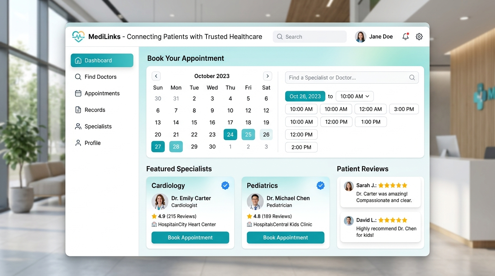

# 🏥 MediLinks — Connecting Patients with Trusted Healthcare

[](#)
[](#)
[](#)
[](#)
[](#)
[](https://github.com/Salimansari369)

> **MediLinks** is a comprehensive, responsive digital healthcare portal bridging patients and verified medical specialists. It offers instant doctor discovery, automated appointment bookings, department lookups, and clinic inquiries.

---

## 📸 Portal Interface & Booking Engine Preview

<p align="center">
  
</p>

*Modern hospital dashboard featuring verified doctor lookup, department triage (Cardiology, Pediatrics), slot reservation, and patient reviews.*

---

## 🌟 Key Features

* **🩺 Doctor Discovery & Specialist Directory:** Search and browse qualified medical professionals across Cardiology, Pediatrics, Neurology, Orthopedics, and General Medicine.
* **📅 Interactive Appointment Reservation (`appointments.html`):** 
  - Dynamic doctor selection based on department.
  - Date and time slot picker.
  - Patient detail validation and symptom description.
  - Instant client-side booking feedback and status update.
* **🏥 Comprehensive Clinic Information (`about.html`):** Overview of clinical infrastructure, certified medical staff, equipment, and core mission.
* **📞 Emergency & Contact Center (`contact.html`):** 24/7 hotline display, urgent care advisories, and interactive feedback/inquiry forms.
* **⚡ Ultra-Lightweight Node.js Server (`serve.js`):** Fast local HTTP server setup for testing and hosting static assets without complex dependencies.

---

## 📂 Project Architecture

```text
medilink/
├── index.html          # Main portal home page, search bar & department catalog
├── appointments.html   # Full-featured doctor appointment reservation engine
├── appointments.js     # Booking logic, form verification & session persistence
├── about.html          # Hospital history, values, and doctor credentials
├── contact.html        # Emergency numbers, interactive form & location info
├── script.js          # Global navbar, mobile toggles, and UI interactions
├── style.css           # Modern medical UI theme with CSS Grid and variables
└── serve.js           # Lightweight Node.js local HTTP server runtime
```

---

## 🚀 Quick Start & Installation

### Option 1: Direct Browser Launch
No build steps or dependencies required!
1. Clone the repository:
   ```bash
   git clone https://github.com/Salimansari369/medilink.git
   cd medilink
   ```
2. Double-click `index.html` to open it in your browser.

### Option 2: Running with Node.js Server
Ensure [Node.js](https://nodejs.org/) is installed:
```bash
# Run the built-in server
node serve.js
```
Open `http://localhost:3000` (or the port displayed in your console) to view the portal.

---

## 🎨 Design & UI Philosophy
* **Accessible Color Palette:** Calming clinical blue and green color tokens communicating hygiene, trust, and professionalism.
* **Mobile-First Responsive Layout:** Full responsiveness across mobile phones, tablets, laptops, and ultra-wide screens.
* **Clear Form Guidance:** Real-time visual feedback for required inputs, emails, phone numbers, and dates.

---

## 👤 Author

* **Salim Ansari**
  * GitHub: [@Salimansari369](https://github.com/Salimansari369)
